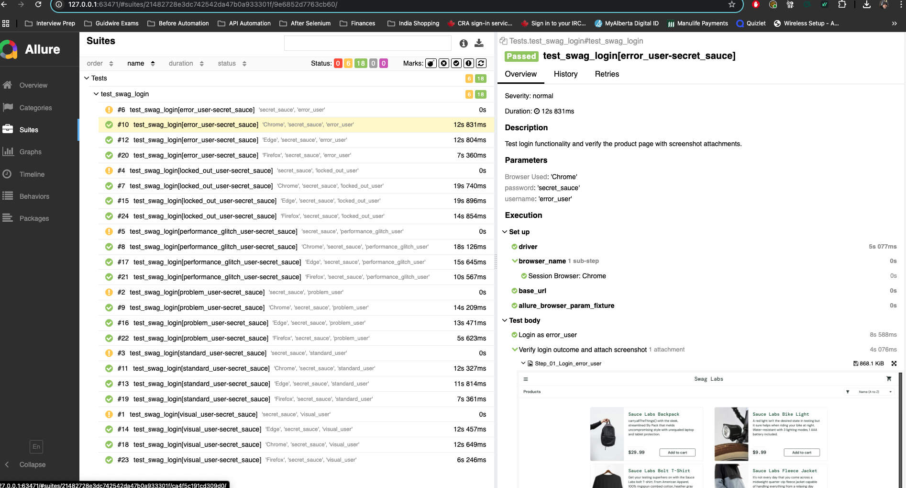

# 🚀 Selenium POM UI Automation Framework

[](https://github.com/SaiVamsiKolla-QA/selenium-pom-ui-tests-python/actions/workflows/selenium-tests.yml)
[](https://www.python.org/downloads/)
[](https://selenium-python.readthedocs.io/)
[](https://docs.pytest.org/)
[](https://docs.qameta.io/allure/)
[](https://opensource.org/licenses/MIT)

[**📊 Latest Allure Report**](https://saivamsikolla-qa.github.io/selenium-pom-ui-tests-python/) | [**🔗 Swag Labs Demo**](https://www.saucedemo.com/)

A robust, production-ready Selenium automation framework built with Python and pytest, implementing the Page Object Model (POM) design pattern. Features comprehensive CI/CD integration, advanced test execution capabilities, and detailed Allure reporting with historical trends.

---

## ✨ Key Features

### Core Capabilities
- **🏗️ Page Object Model (POM)** - Clean, maintainable test architecture
- **🌐 Cross-Browser Support** - Chrome, Firefox, Edge, Safari
- **⚡ Parallel Execution** - Multi-level parallelization (browser & test level)
- **🖥️ Cross-Platform** - Windows, macOS, Linux compatibility
- **📸 Visual Documentation** - Automatic screenshot capture at every step

### Advanced Features
- **📊 Allure Reporting** - Rich reports with history trends and analytics
- **🔄 CI/CD Integration** - GitHub Actions with automated deployments
- **📈 Performance Metrics** - Execution statistics and trend analysis
- **📧 Email Notifications** - Automated test result summaries
- **🎯 Flexible Execution** - Multiple test execution strategies
- **🧹 Auto-Cleanup** - Browser process management

---

## 🛠️ Prerequisites

Ensure you have the following installed:

| Requirement | Version | Purpose | Installation |
|-------------|---------|---------|--------------|
| **Python** | 3.9+ | Core runtime | [python.org](https://www.python.org/downloads/) |
| **Git** | Latest | Version control | [git-scm.com](https://git-scm.com/) |
| **Chrome** | Latest | Default browser | [google.com/chrome](https://www.google.com/chrome/) |
| **Java JDK** | 8+ | Allure reports | [oracle.com/java](https://www.oracle.com/java/technologies/downloads/) |

Optional browsers:
- **Firefox** - [mozilla.org/firefox](https://www.mozilla.org/firefox/)
- **Edge** - [microsoft.com/edge](https://www.microsoft.com/edge)
- **Safari** - Pre-installed on macOS

---

## 🚀 Quick Start

### 1. Clone the Repository

```bash
# Clone the repository
git clone https://github.com/SaiVamsiKolla-QA/selenium-pom-ui-tests-python.git

# Navigate to project directory
cd selenium-pom-ui-tests-python
```

### 2. Set Up Virtual Environment

<details>
<summary>🪟 Windows</summary>

```bash
# Create virtual environment
python -m venv .venv

# Activate virtual environment 
.venv\Scripts\activate

# To deactivate later:
deactivate
```
</details>

<details>
<summary>🐧 macOS/Linux</summary>

```bash
# Create virtual environment
python -m venv .venv

# Activate virtual environment
source .venv/bin/activate

# To deactivate later:
deactivate
```
</details>

### 3. Install Dependencies

```bash
# Install all required packages
pip install -r Requirements.txt
```

### 4. Install Allure CLI

<details>
<summary>🍎 macOS (Homebrew)</summary>

```bash
brew install allure
```
</details>

<details>
<summary>🪟 Windows (Scoop)</summary>

```bash
# Install Scoop if not already installed
iwr -useb get.scoop.sh | iex

# Install Allure
scoop install allure
```
</details>

<details>
<summary>🪟 Windows (Chocolatey)</summary>

```bash
# Install Chocolatey if not already installed
# Run PowerShell as Administrator

# Install Allure
choco install allure-commandline
```
</details>

### 5. Verify Installation

```bash
# Run the setup verification script
python setup_check.py
```

This validates:
- ✅ Python version compatibility
- ✅ Required packages installation
- ✅ Browser driver availability
- ✅ Allure CLI setup
- ✅ Directory permissions

---

## 📁 Project Structure

```
selenium-pom-ui-tests-python/
├── 📂 .github/
│   └── workflows/              # GitHub Actions CI/CD workflows
├── 📂 Pages/                   # Page Object Model classes
│   ├── login_page.py          # Login page objects
│   ├── inventory_page.py      # Product listing page
│   └── checkout_page.py       # Checkout flow pages
├── 📂 Tests/                   # Test scripts
│   ├── conftest.py            # Pytest configuration & fixtures
    ├── test_swag_login.py     # Login functionality tests
│   ├── test_swag_checkout.py  # Checkout process tests
│   └── test_swag_end_to_end.py # End-to-end scenarios
├── 📂 Utility/                 # Helper functions
│   └── utility.py             # Screenshot and common utilities
├── 📂 assets/
│   └── screenshots/           # Test execution screenshots
├── 📂 allure-results/         # Test execution results
│   ├── chrome/                # Browser-specific results
│   ├── firefox/               
│   └── multi-browser/         # Multi-browser run results
├── 📂 allure-report/          # Generated HTML reports
├── 📂 reports/                # Archived test reports
├── 📄 cleanup.py              # Browser process cleanup utility
├── 📄 setup_check.py          # Environment verification
├── 📄 run_tests.sh            # Test runner (macOS/Linux)
├── 📄 run_tests.bat           # Test runner (Windows)
├── 📄 Requirements.txt        # Python dependencies
├── 📄 Test cases - SwagLabs.xlsx  # Manual test scenarios
└── 📄 README.md              # Project documentation
```

---

## 🏃‍♂️ Test Execution Guide

### 🚄 Quick Test Execution

The simplest way to run tests with default settings:

<details>
<summary>🪟 Windows</summary>

```bash
# Run with default settings (Chrome, single run)
run_tests.bat

# Run with specific browser
run_tests.bat -b firefox

# Run with parallel execution
run_tests.bat -p 4

# Run and open report
run_tests.bat -o
```
</details>

<details>
<summary>🐧 macOS/Linux</summary>

```bash
# Make script executable (first time only)
chmod +x run_tests.sh

# Run with default settings
./run_tests.sh

# See all available options
./run_tests.sh -h
```
</details>

### 🎯 Advanced Test Execution (macOS/Linux)

The `run_tests.sh` script provides powerful test execution capabilities:

#### Single Browser Testing

```bash
# Run all tests once on Chrome (default)
./run_tests.sh

# Run specific test file 5 times
./run_tests.sh Tests/test_swag_login.py -n 5

# Run on Firefox with 10 iterations
./run_tests.sh Tests/test_swag_login.py -n 10 -b firefox

# Parallel execution with 6 workers and auto-open report
./run_tests.sh Tests/ -n 5 -p 6 -o

# Quick run without report generation
./run_tests.sh --no-report
```

#### Multi-Browser Testing

```bash
# Run tests on all browsers sequentially
./run_tests.sh --all-browsers

# Run tests on all browsers in parallel (fastest)
./run_tests.sh --all-browsers --parallel-browsers

# Multi-browser with multiple iterations
./run_tests.sh --all-browsers -n 3 -o

# Maximum parallelization: parallel browsers + parallel tests
./run_tests.sh --all-browsers --parallel-browsers -n 5 -p 4 -o
```

#### Command Options Reference

| Option | Long Form | Description | Example |
|--------|-----------|-------------|---------|
| `-n` | `--iterations` | Number of test runs | `-n 5` |
| `-b` | `--browser` | Browser selection | `-b firefox` |
| `-p` | `--parallel` | Parallel workers | `-p 4` |
| `-o` | `--open-report` | Auto-open report | `-o` |
| | `--all-browsers` | Test all browsers | `--all-browsers` |
| | `--parallel-browsers` | Run browsers simultaneously | `--parallel-browsers` |
| | `--no-report` | Skip report generation | `--no-report` |
| `-h` | `--help` | Show help | `-h` |

### 📊 Test Execution Examples

<details>
<summary>🎯 Common Scenarios</summary>

```bash
# Quick smoke test
./run_tests.sh Tests/test_swag_login.py --no-report

# Regression test suite
./run_tests.sh Tests/ -n 3 -p 4 -o

# Cross-browser compatibility check
./run_tests.sh --all-browsers --parallel-browsers -o

# Performance testing (100 iterations)
./run_tests.sh Tests/test_swag_login.py -n 100 -p 8 --no-report

# CI/CD simulation
./run_tests.sh --all-browsers -n 5 -p 4
```
</details>

### 📈 Understanding Test Metrics

The test runner provides comprehensive metrics:

```
📈 TEST EXECUTION SUMMARY
================================================================================
🌐 Browser: CHROME
📊 Results: 45 passed, 5 failed
🎯 Success rate: 90.00%
⏱️  Total execution time: 125.67 seconds
📐 Average run time: 2.51 seconds
📏 Min: 1.89s, Max: 3.14s
📊 Standard Deviation: 0.42s
```

---

## 💻 Running the Selenium Grid Locally

To run the Selenium Grid locally for distributed testing, follow these steps:

*   **Install Docker and Docker Compose:**
    *   For Ubuntu, you can use the following commands:
        ```bash
        sudo apt-get update
        sudo apt-get install docker-ce docker-ce-cli containerd.io docker-compose-plugin
        ```
    *   For other operating systems, or if you prefer a GUI, download and install [Docker Desktop](https://www.docker.com/products/docker-desktop).
*   **Start the Grid:** Run the following command to start the Selenium Grid with 2 Chrome nodes and 2 Firefox nodes:
    ```bash
    docker-compose up -d --scale node-chrome=2 --scale node-firefox=2
    ```
*   **Set Environment Variables:** Configure your environment to point to the local grid:
    ```bash
    export SELENIUM_REMOTE_URL="http://localhost:4444/wd/hub"
    export BROWSER="chrome"  # Or "firefox"
    ```
*   **Execute Tests:** Run your tests using the test execution script:
    ```bash
    ./run_tests.sh
    ```
*   **Shut Down Grid:** Once testing is complete, shut down the grid:
    ```bash
    docker-compose down
    ```

This setup allows you to test your application in a distributed environment, simulating a more realistic production setup and speeding up test execution by running tests in parallel across different browser instances.

---

## 🌐 Browser Configuration

### Supported Browsers

| Browser | Platform Support | Parallel Support | Special Setup |
|---------|-----------------|------------------|---------------|
| Chrome | ✅ All | ✅ Yes | Auto-managed |
| Firefox | ✅ All | ✅ Yes | Auto-managed |
| Edge | ✅ Windows/Mac | ✅ Yes | Auto-managed |
| Safari | ✅ macOS only | ⚠️ Limited | Manual setup required |

### Safari Configuration (macOS)

Safari requires additional setup:

1. Enable Developer Menu:
   - Safari → Preferences → Advanced → Show Develop menu
2. Allow Remote Automation:
   - Develop menu → Allow Remote Automation
3. First run may require password authorization

**Note**: Safari has limited support for parallel execution. Consider running Safari tests separately.

---

## 📊 Allure Reporting Features

### Report Generation

```bash
# Generate and serve report from latest results
allure serve allure-results/chrome

# Generate static report
allure generate allure-results/chrome -o allure-report/chrome --clean

# Open existing report
allure open allure-report/chrome
```

### Report Features

- **📈 Trends** - Historical test execution trends
- **📊 Analytics** - Pass/fail ratios, execution times
- **🏷️ Categories** - Tests organized by type
- **📸 Screenshots** - Visual evidence for each step
- **🔍 Full Traces** - Detailed error information
- **⏱️ Timeline** - Test execution timeline
- **🌐 Environment** - Test environment details

### Accessing Reports

1. **Local Reports**: Run `allure serve` after test execution
2. **CI Reports**: View on [GitHub Pages](https://saivamsikolla-qa.github.io/selenium-pom-ui-tests-python/)
3. **Archived Reports**: Check `reports/` directory

### 📸 Allure Report Screenshots

<details>
<summary>📊 Report Overview Dashboard</summary>


**Key Features Shown:**
- **Overall Pass Rate**: Visual representation of test success (75% in this example)
- **Test Execution Trend**: Historical view showing test growth and stability
- **Environment Details**: Complete test environment information
- **Categories**: Browser compatibility issues tracking
- **Execution Summary**: Parallel multi-browser test execution details
</details>

<details>
<summary>📋 Detailed Test Results</summary>



**Key Features Shown:**
- **Test Suite Organization**: Tests grouped by functionality
- **Multiple User Types**: Comprehensive testing with different user scenarios
- **Execution Details**: Duration, browser, and status for each test
- **Visual Evidence**: Screenshots attached to each test step
- **Parameter Tracking**: Browser and user credentials clearly displayed
- **Real-time Results**: Live test execution monitoring
</details>

### 🎯 Report Highlights

Our Allure reports provide:

1. **📈 Trend Analysis**
   - Track test suite growth over time
   - Monitor stability and reliability trends
   - Identify patterns in test failures

2. **🔍 Detailed Test Information**
   - Step-by-step test execution logs
   - Visual screenshots at each critical step
   - Complete error traces for failed tests
   - Test parameters and environment data

3. **📊 Analytics & Metrics**
   - Pass/Fail ratios by browser
   - Execution time analysis
   - Category-based failure grouping
   - Historical comparison data

4. **🖼️ Visual Documentation**
   - Automatic screenshot capture on failures
   - Step-by-step visual verification
   - Before/After comparisons
   - Full-page captures for E2E tests

---

## 🔧 Manual Test Execution

For specific test control:

```bash
# Run specific test class
pytest Tests/test_swag_login.py -v

# Run specific test method
pytest Tests/test_swag_login.py::test_swag_login -v

# Run with specific marker
pytest -m "smoke" -v

# Generate Allure results
pytest Tests/ -v --alluredir=allure-results/custom

# Run with custom timeout
pytest Tests/ -v --timeout=300
```

---

## 🧹 Maintenance Utilities

### Browser Cleanup

```bash
# Clean up hanging browser processes
python cleanup.py
```

### Clear Test Data

```bash
# Clear previous results
rm -rf allure-results/*
rm -rf allure-report/*
rm -rf reports/*

# Clear screenshots
rm -rf assets/screenshots/*
```

---

## 🔄 CI/CD Integration

### GitHub Actions Features

The automated pipeline includes:

- **🔄 Triggers**: Push/PR to main, manual dispatch
- **🌐 Matrix Testing**: Multiple Python versions
- **📊 Allure Integration**: Report generation and deployment
- **📧 Notifications**: Email summaries
- **🚀 GitHub Pages**: Automatic report hosting
- **📦 Artifacts**: Test results preservation

### Manual Workflow Execution

1. Go to repository **Actions** tab
2. Select **"CI with Dynamic Allure Report and Email"**
3. Click **"Run workflow"**
4. Configure parameters:
   - Branch selection
   - Test scope
   - Browser choice
5. Click **"Run workflow"**

---

## 🐛 Troubleshooting

### Common Issues

<details>
<summary>❌ WebDriver Issues</summary>

```bash
# Error: ChromeDriver version mismatch
# Solution: Update Chrome browser or clear driver cache
webdriver-manager clean

# Error: Driver not found
# Solution: Reinstall webdriver-manager
pip install --upgrade webdriver-manager
```
</details>

<details>
<summary>❌ Allure Issues</summary>

```bash
# Error: Allure command not found
# Check Java installation
java -version

# Reinstall Allure
brew reinstall allure  # macOS
scoop uninstall allure && scoop install allure  # Windows

# Error: No results to generate report
# Ensure tests produced results
ls -la allure-results/
```
</details>

<details>
<summary>❌ Import Errors</summary>

```bash
# Error: Module not found
# Verify virtual environment is activated
which python  # Should show .venv path

# Reinstall dependencies
pip install -r Requirements.txt --force-reinstall

# Clear Python cache
find . -type d -name __pycache__ -exec rm -rf {} +
```
</details>

<details>
<summary>❌ Permission Errors</summary>

```bash
# Error: Permission denied for run_tests.sh
chmod +x run_tests.sh

# Error: Cannot create directory
# Check directory permissions
ls -la

# Run with appropriate permissions
sudo chown -R $USER:$USER .
```
</details>

### Debug Mode

```bash
# Run with pytest debug output
pytest Tests/ -v -s --log-cli-level=DEBUG

# Run with Python debugging
python -m pdb -m pytest Tests/test_swag_login.py

# Check environment variables
python -c "import os; print(os.environ)"
```

---

## 🤝 Contributing

We welcome contributions! Please follow these guidelines:

### Development Workflow

1. **Fork** the repository
2. **Clone** your fork:
   ```bash
   git clone https://github.com/YOUR_USERNAME/selenium-pom-ui-tests-python.git
   ```
3. **Create** feature branch:
   ```bash
   git checkout -b feature/amazing-feature
   ```
4. **Make** changes following coding standards
5. **Test** thoroughly:
   ```bash
   # Run tests locally
   ./run_tests.sh Tests/ -n 3
   
   # Check code style
   flake8 Pages/ Tests/ Utility/
   ```
6. **Commit** with clear messages:
   ```bash
   git commit -m "feat: add amazing feature
   
   - Detailed description
   - What problem it solves
   - Breaking changes (if any)"
   ```
7. **Push** to your fork:
   ```bash
   git push origin feature/amazing-feature
   ```
8. **Create** Pull Request with description

### Coding Standards

- ✅ Follow PEP 8 style guide
- ✅ Add docstrings to all functions
- ✅ Write meaningful test descriptions
- ✅ Include type hints where applicable
- ✅ Update documentation
- ✅ Add tests for new features
- ✅ Ensure all tests pass

### PR Requirements

- Clear description of changes
- Screenshots for UI changes  
- Test results summary
- Updated documentation
- No merge conflicts

---

## 📄 License

This project is licensed under the [MIT License](LICENSE) - see the LICENSE file for details.

---

## 🙏 Acknowledgments

- [Selenium WebDriver](https://selenium-python.readthedocs.io/) - Browser automation
- [Pytest](https://docs.pytest.org/) - Testing framework
- [Allure Framework](https://docs.qameta.io/allure/) - Test reporting
- [Swag Labs](https://www.saucedemo.com/) - Demo application
- [GitHub Actions](https://github.com/features/actions) - CI/CD platform

---

## 📞 Contact & Support

- 👤 **Author**: Sai Vamsi Kolla
- 📧 **Email**: saivamsikolla@gmail.com
- 🐛 **Issues**: [GitHub Issues](https://github.com/SaiVamsiKolla-QA/selenium-pom-ui-tests-python/issues)
- 💬 **Discussions**: [GitHub Discussions](https://github.com/SaiVamsiKolla-QA/selenium-pom-ui-tests-python/discussions)
- 📚 **Wiki**: [Project Wiki](https://github.com/SaiVamsiKolla-QA/selenium-pom-ui-tests-python/wiki)

---

<div align="center">

### ⭐ Star this repository if you find it helpful!

**Built with ❤️ by Sai Vamsi Kolla**

[](https://github.com/SaiVamsiKolla-QA)
[](https://github.com/SaiVamsiKolla-QA/selenium-pom-ui-tests-python)

</div>